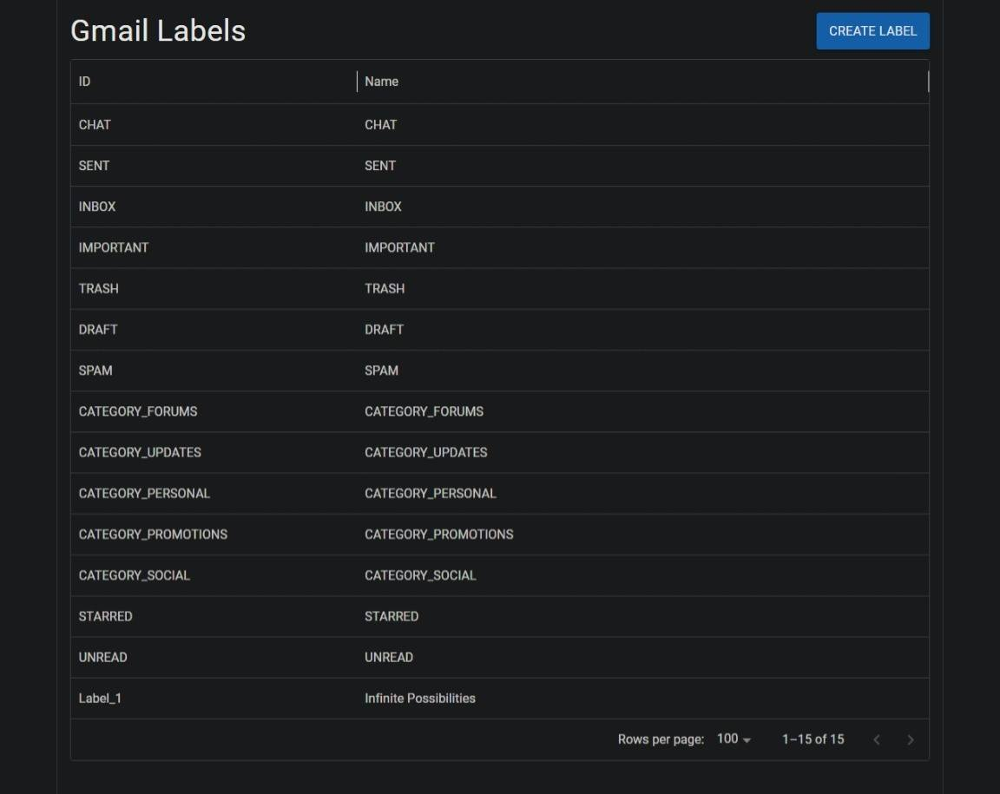
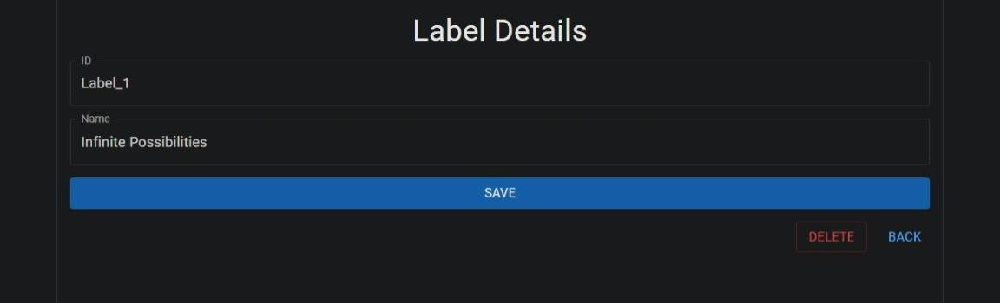

# Gmail Label Manager

A full-stack application built for the **gPanel Cloud Integration Coding Challenge**.

The application demonstrates a complete vertical slice integrating a React frontend with a Spring Boot backend that communicates with the Google Gmail API. Users can view, create, update, and delete Gmail labels through a Material UI interface.

---

## Screenshots

### Label List


### Label Details


---

## Tech Stack

### Backend
- Java
- Spring Boot
- Maven
- Google Gmail API

### Frontend
- React
- TypeScript
- Vite
- Material UI
- TanStack Query
- React Router
- React Hook Form

---

# Project Structure

```
backend/
    Spring Boot REST API
    Gmail API integration
    OAuth authentication
```
```
frontend/
    React + TypeScript + Vite
    Material UI
    TanStack Query
    React Router
```

---

# Features

- View all Gmail labels (via Material UI DataGrid)
- Navigate to label details upon row selection
- View label details by id
- Create Gmail labels
- Update Gmail labels
- Delete Gmail labels
- Google OAuth authentication using the installed application flow

---

# Prerequisites

Before running the application, install:

- Java (JDK 21)
- Maven
- Node.js
- npm

- A Google Cloud project with Gmail API access

---

# Google OAuth Setup

This application authenticates using the Gmail API through Google's installed application OAuth flow. In this section, a set of Desktop App credentials will be generated. Existing desktop credentials may be used instead. 

## 1. Create Google Cloud Credentials

1. Create a project in the Google Cloud Console.
   https://console.cloud.google.com/

2. Enable the Gmail API for the project.
   https://console.cloud.google.com/apis/library/browse

3. Open the Credentials page.
   https://console.cloud.google.com/apis/credentials

4. Create an **OAuth Client ID** credential.
   - Application Type: **Desktop App**
   - Download the JSON file containing the client secret. 

5. Open the Audience page.
	https://console.cloud.google.com/auth/audience

6. Add your Google account as a **Test User**.

The downloaded credentials should take the form of:
```
{
  "installed":{
    "client_id":"1234...ABCD.apps.googleusercontent.com",
	...
    "redirect_uris":["http://localhost"]
  }
}
```

---

## 2. Configure Credentials

Place the downloaded JSON file inside `backend/credentials/`. This file should be named `credentials.json`. 

Note: The contents of this directory are excluded by .gitignore. 

---

## 3. First Launch

When the backend starts for the first time with valid credentials, the console will display:

```
Please open the following address in your browser:
```

Open the provided URL, sign in with the Google account authorized in the **Test users** section earlier, and authorize the application.

After the initial authorization, subsequent launches reuse the stored refresh token and do not require signing in again. OAuth tokens are stored locally in the `tokens/` directory. Deleting this directory will force a new authorization flow.

> The project intentionally uses Google's Installed Application OAuth flow because the backend is designed to run locally during evaluation rather than as a deployed web application.

---

# Running the Backend

```bash
cd backend
mvn spring-boot:run
```

The backend will start on the configured Spring Boot port.
- <http://localhost:8080/gmail/labels>

---

# Running the Frontend

```bash
cd frontend
npm install
npm run dev
```

Open the Vite development URL shown in the console.
- <http://localhost:5173/labels>

---

# Scope

This  implementation exposes only the Gmail label **name** during operations.
The Gmail API also supports additional label properties:
- `MessageListVisibility`
- `LabelListVisibility`

These fields are intentionally omitted to keep the challenge focused on the core CRUD workflow.

---

# Testing

The backend includes controller tests using MockMvc to verify:

- Request routing
- Input validation
- HTTP response codes
- Service interaction

The service layer is isolated from the Gmail API using mocking to verify controller behavior independently of Google's services.

Given the scope of the exercise, exhaustive integration testing against the live Gmail API was not included.

---

# Potential Improvements

- Add optimistic UI updates using TanStack Query.
- Improve error handling and user-facing error messages.
- Add client-side validation for invalid or duplicate label names.
- Add comprehensive integration tests against the Gmail API.